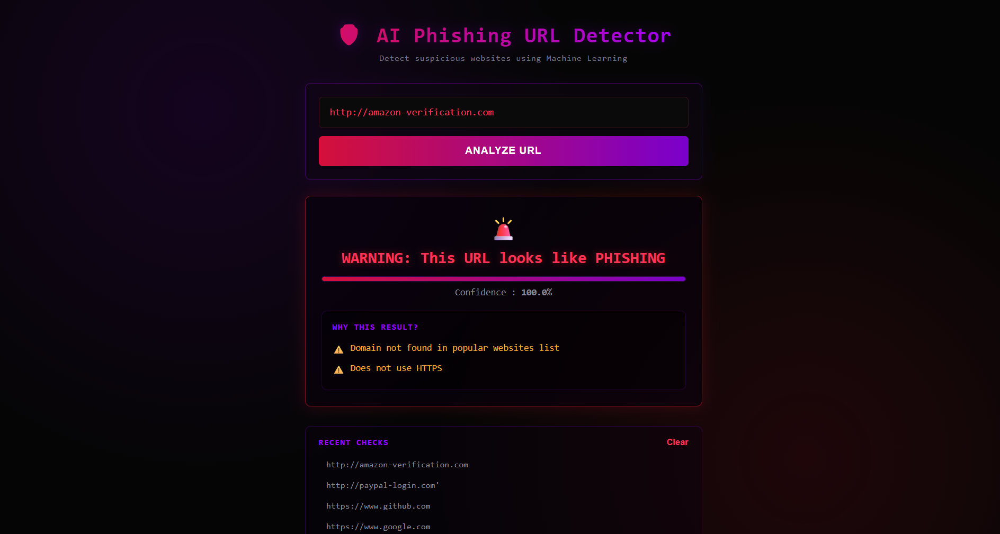

🔐 AI Phishing Link Checker

An AI-powered web application that analyzes URLs and predicts whether they are legitimate or potentially phishing using Machine Learning.

The application uses Python, Flask, and a Random Forest classifier to analyze lexical characteristics of URLs and provide a prediction along with a confidence score.

📌 Overview

Phishing attacks often use malicious URLs to trick users into visiting fake websites or sharing sensitive information.

This project aims to provide a simple way to analyze a URL and identify suspicious characteristics using a Machine Learning-based approach.

How it works
User enters URL
       ↓
URL Feature Extraction
       ↓
Machine Learning Model
       ↓
Random Forest Classifier
       ↓
Prediction + Confidence Score
✨ Features
🔍 Detects potentially phishing and legitimate URLs
🤖 Machine Learning-based URL classification
🌲 Random Forest classification model
📊 Provides prediction confidence
🌐 Simple Flask-based web interface
⚡ Fast URL analysis
🧩 Modular feature extraction and model-training scripts
🛠️ Tech Stack
Programming & Frameworks
Python
Flask
HTML
CSS
Machine Learning & Data Processing
Scikit-learn
Pandas
NumPy
Cybersecurity Concepts
Phishing URL Detection
Malicious URL Analysis
URL Feature Extraction
Web Security
📂 Project Structure
AI-Phishing-Link-Checker/
│
├── Screenshots/
│
├── static/
│
├── templates/
│
├── app.py
├── augment_data.py
├── build_dataset.py
├── check_training_data.py
├── debug_check.py
├── download_top_domains.py
├── explore_data.py
├── feature_extraction.py
├── prepare_data.py
├── train_model.py
│
├── requirements.txt
├── .gitignore
├── .gitattributes
├── LICENSE
└── README.md
⚙️ Installation & Setup
1. Clone the repository
git clone https://github.com/rohinikumari90/AI-Phishing-Link-Checker.git
2. Navigate to the project directory
cd AI-Phishing-Link-Checker
3. Install the required dependencies
pip install -r requirements.txt
4. Run the Flask application
python app.py
5. Open the application

Open the local URL displayed by Flask in your web browser.

🖥️ Application Screenshots

Screenshots of the application are available in the Screenshots folder.

🔎 Example Workflow
Enter a URL into the web application.
The application extracts relevant URL characteristics.
The trained Random Forest model analyzes the extracted features.
The application displays the predicted classification.
A confidence score is provided along with the result.
🎯 Project Objectives
Understand how Machine Learning can be applied to cybersecurity.
Analyze URL characteristics associated with phishing websites.
Build a practical cybersecurity-focused web application.
Implement a Machine Learning classification workflow.
Create a simple interface for non-technical users.
🚀 Future Improvements

Possible future enhancements include:

Browser extension for real-time URL checking
Integration with real-time threat intelligence feeds
REST API for external applications
Deep Learning-based URL classification
Improved feature engineering
Larger and more diverse datasets
Model performance evaluation and visualization
URL reputation checking using external security APIs
⚠️ Disclaimer

This project is intended for educational and research purposes.

The prediction generated by the application should not be considered a definitive security verdict. Users should avoid entering sensitive information on suspicious websites and use additional security tools for verification.

👩‍💻 Author

Rohini Kumari

BCA Cyber Security Student

GitHub: rohinikumari90

📄 License

This project is licensed under the MIT License.
